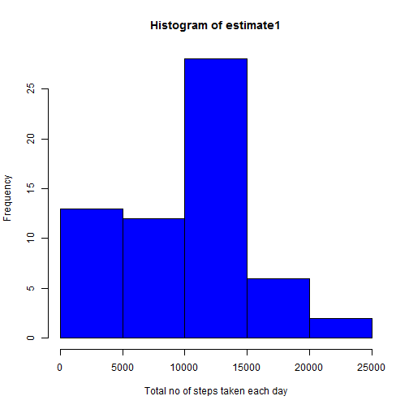
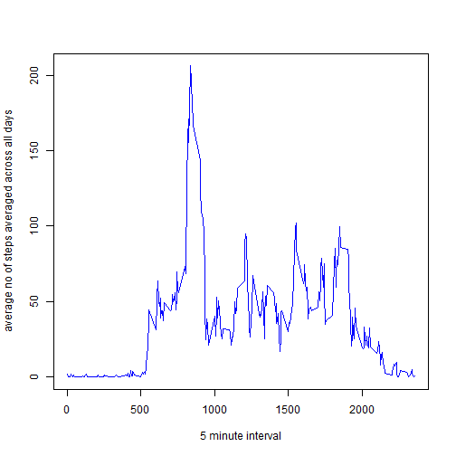
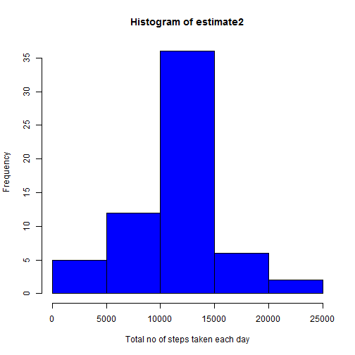
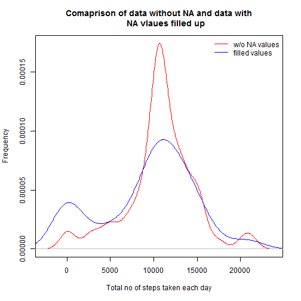

# Reproducible Research: Peer Assessment 1

This markdown file contains code and answers for "Reproducible Research"
peer assesmnet - 1. For deatiled intrsuctions, please look at instructions.pdf
lying in the "doc" folder.

## Loading and preprocessing the data

1. load the data

```r
rm(list = ls())

# loading the data
data <- read.csv(unz(description = file.path(getwd(), "activity.zip"), filename = "activity.csv"), 
    header = TRUE, sep = ",")
```


2. Pre-processing the data


```r
completedata <- data[complete.cases(data), ]
nadata <- data[!complete.cases(data), ]
```


## What is mean total number of steps taken per day?

1. Make a histogram of the total number of steps taken each day
2. Calculate and report the mean and median total number of steps taken per day

For This part of the assignment we will work only with data which have no NAs.
We then work out the total number of steps for each day, create the histogram of
that set and calculate the mean and median.
Since this functionality will be used later - we create a function.


```r
calculate_histo_mean_meadian <- function(df) {
    sp <- split(df, as.factor(df$date))
    sapply(sp, function(x) {
        sum(x$steps)
    })
    
}

estimate1 <- calculate_histo_mean_meadian(completedata)
hist(estimate1, xlab = "Total no of steps taken each day", col = "blue")
```

 

```r
mean1 = mean(estimate1)
median1 = median(estimate1)
```


## What is the average daily activity pattern?


1. Make a time series plot (i.e. type = "l") of the 5-minute interval (x-axis) 
and the average number of steps taken, averaged across all days (y-axis)


```r
sp2 <- split(data, as.factor(data$interval))
avgsteps <- sapply(sp2, function(x) {
    mean(x$steps, na.rm = TRUE)
})
avgstepsdf <- data.frame(interval = names(avgsteps), avgsteps = avgsteps)

plot(names(avgsteps), avgsteps, type = "l", xlab = "5 minute interval", ylab = "average no of steps averaged across all days", 
    col = "blue")
```

 


2. Which 5-minute interval, on average across all the days in the dataset, 
contains the maximum number of steps?


```r
idx <- names(avgsteps[which(avgsteps == max(avgsteps))])
idx
```

```
## [1] "835"
```


The 835, is the 5-minute interval, on average across all the days in the 
dataset, that contains the maximum number of steps

## Imputing missing values

1. Calculate and report the total number of missing values in the dataset 
We already calculated data with NA values in the pre-processing step. 

Thus, the total number of rows with NAs is 2304

2. Devise a strategy for filling in all of the missing values in the dataset. 

The  following strategy was used to fill all of the missing values in the 
dataset- We used the mean for that 5-minute interval

Since all the NA's are in the steps column , we can replace it with means for
the corresponding 5-minute interval using the following code:

```r
nadata$steps <- apply(nadata, 1, function(x) {
    int <- as.numeric(x["interval"])
    avgstepsdf[match(int, avgstepsdf$interval), "avgsteps"]
})
```

3. create a new dataset with filled in values. 

```r
filleddata <- rbind(completedata, nadata)
```


4. Make a histogram of the total number of steps taken each day ,Calculate and 
report the mean and median total number of steps taken per day.


```r
estimate2 <- calculate_histo_mean_meadian(filleddata)
hist(estimate2, xlab = "Total no of steps taken each day", col = "blue")
```

 

```r
mean2 = mean(estimate2)
median2 = median(estimate2)
```


5. difference between estimates. 

Yes, there is a difference between estinates taken at different points:


```r

plot(density(estimate2), col = "red", xlab = "Total no of steps taken each day", 
    ylab = "Frequency", main = "Comaprison of data without NA and data with\n      NA vlaues filled up")
lines(density(estimate1), col = "blue")
legend("topright", legend = c("w/o NA values", "filled values"), lty = 1, col = c("red", 
    "blue"), bty = "n")
```

 


data with complete cases had median 10395
and mean 9354.2295

data with filled up NA values had median 1.0766 &times; 10<sup>4</sup>
and mean 1.0766 &times; 10<sup>4</sup>


## Are there differences in activity patterns between weekdays and weekends?

the variable weekst is coded 1 for weekdays and 0 for weekends. 

```r
## find the weekday

filleddata$day <- weekdays(as.Date(filleddata$date))
filleddata$weekst <- sapply(filleddata$day, function(x) {
    ifelse(x == "Saturday" | x == "Sunday", 0, 1)
})
spweek <- split(filleddata, as.factor(filleddata$weekst))

sp2 <- split(spweek[[1]], as.factor(spweek[[1]]$interval))
weekend <- sapply(sp2, function(x) {
    mean(x$steps, na.rm = TRUE)
})

sp3 <- split(spweek[[2]], as.factor(spweek[[2]]$interval))
weekday <- sapply(sp3, function(x) {
    mean(x$steps, na.rm = TRUE)
})

par(mfrow = c(2, 1))
plot(names(weekend), weekend, type = "l", xlab = "5 minute interval", ylab = "average no of steps averaged across weekend", 
    col = "blue")
plot(names(weekday), weekday, type = "l", xlab = "5 minute interval", ylab = "average no of steps averaged weekdays", 
    col = "blue")
```

 

